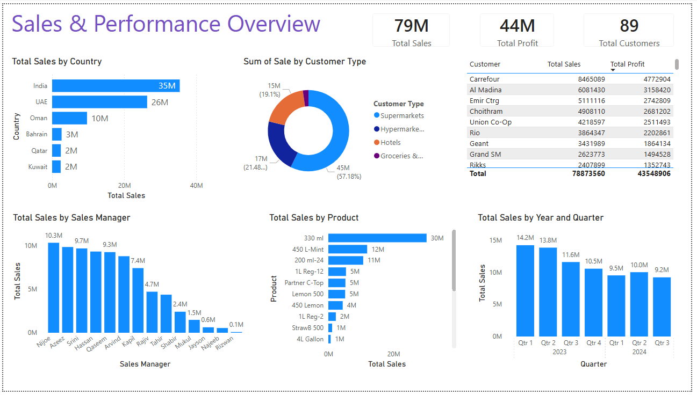

# Performance Dashboard (Power BI)

## Overview
This Power BI dashboard was designed to support management information
reporting by providing a clear view of performance against key metrics.

The focus is on clarity, usability, and decision-ready insight rather
than overly complex analytics.

## Objectives
- Provide an executive-level performance overview
- Track KPIs across regions, products, and customer segments
- Highlight trends and variances over time

## Tools Used
- Power BI
- Excel
- SQL (data preparation)

## Notes
Data has been anonymised. Screenshots are provided to demonstrate the
dashboard structure and reporting approach.
